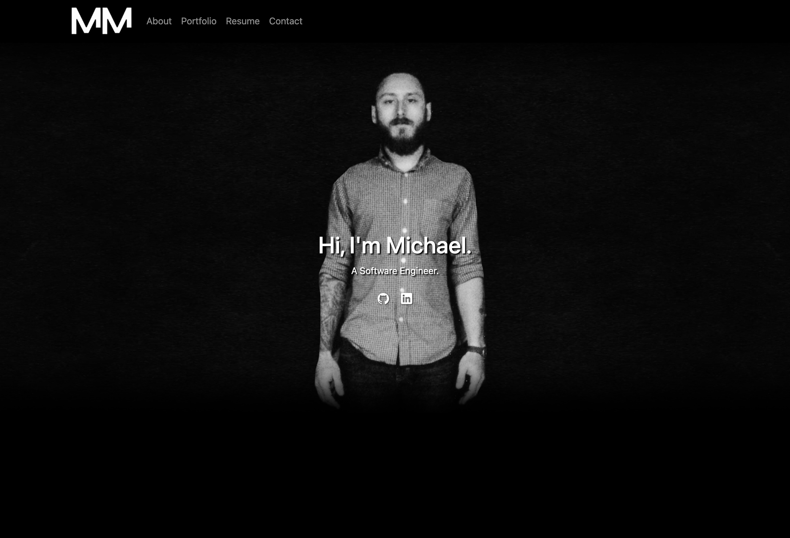

# React Portfolio - Michael Martens
<p />By Michael Martens

[](https://opensource.org/licenses/MIT)

## Description
This is re-work of sorts of my initial portfolio, but in React! 

The styling and interactivity is handled in large part by Bootstrap, with some customization on my end. I'm also utilizing a handful of packages such as ```react-scroll``` to help build some state into the app and handle navigating between the navbar and each section.


<br>

## Table of Contents
[License](#license)<br />[Questions](#questions)

## License
This project is licensed under the MIT license.

A short and simple permissive license with conditions only requiring preservation of copyright and license notices. Licensed works, modifications, and larger works may be distributed under different terms and without source code.<p />For more information visit https://choosealicense.com/licenses/mit/.

## Questions
Find me on Github at https://github.com/makeithappenmike<p/>You can reach me at omichaelaaron@gmail.com if you have any questions.